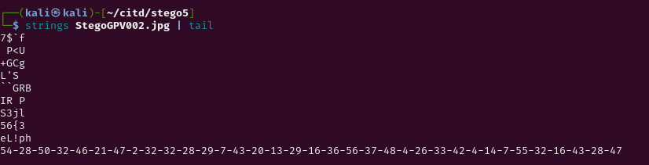
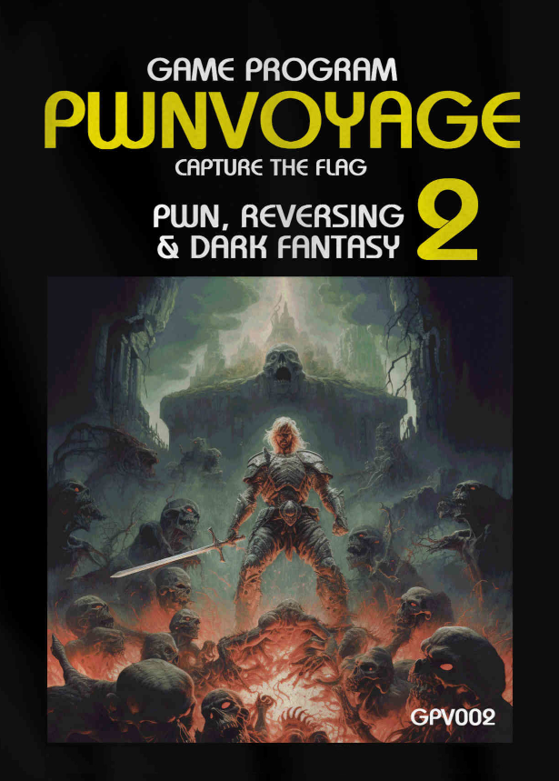

The challenge was simpler than all of you thought:
by analyzing a bit the image bytes we found this:
	

	
those numbers are weird and i tried them for a lot of substitution but none of them worked...
Then i looked at the poster and the intuition came to my mind..
Of course: those numbers are the index of the letters in the poster!!
from up to bottom from left to right, just replace the _&_ with _{}_
and u got ur flag after a bit of counting!
	

Like the first number is the letter N (the first letter of the flag) from the word FANTASY and so on..
<!-->
54 28 50 32 46 21 47(is & but u will change this at the end)
<!-->
N  T  R  L  G  C  {..}
	
